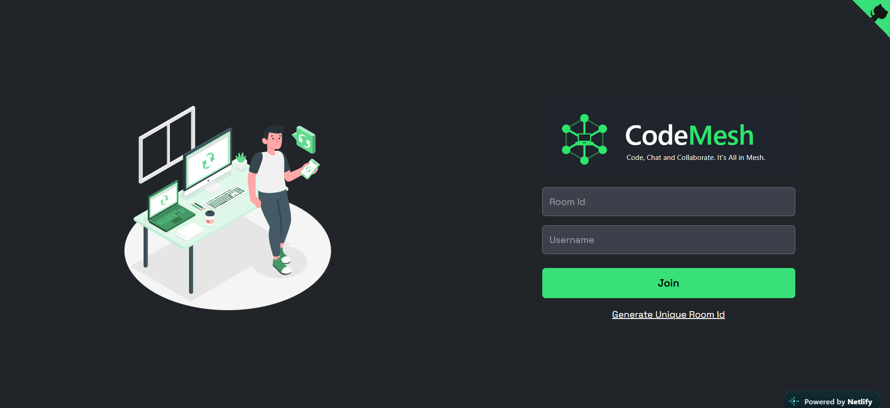
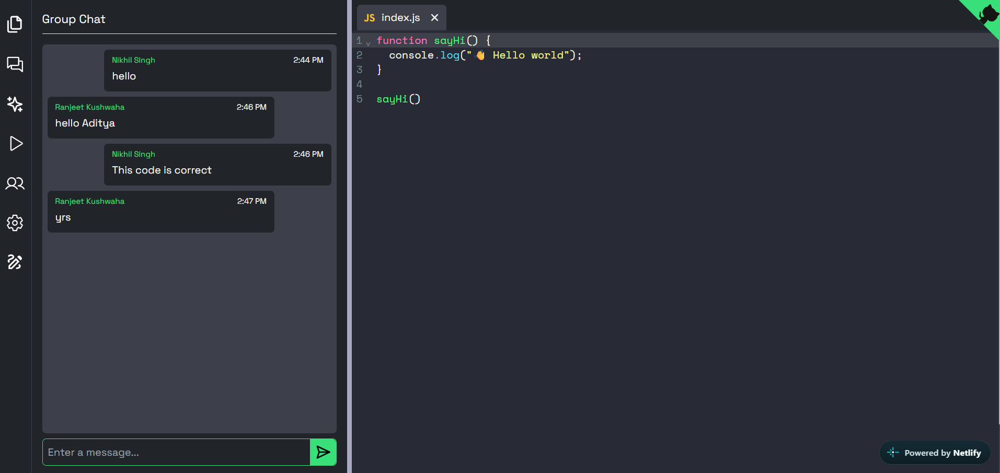
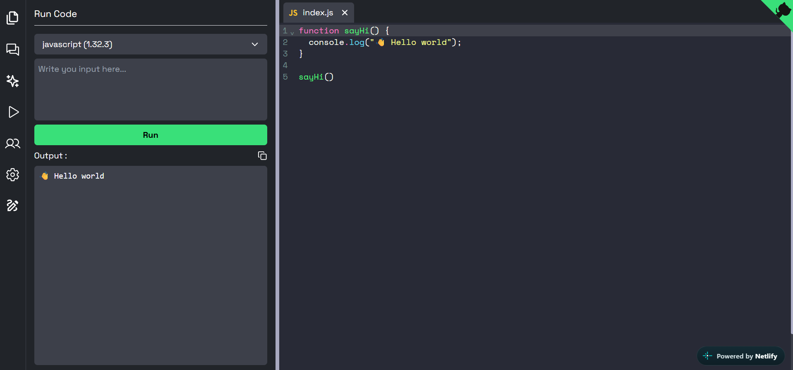
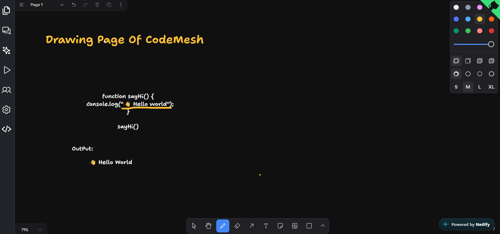

# CodeMesh

A full-stack real-time collaborative coding platform where developers can write code together, chat, sketch ideas on a shared drawing board, and generate code with an AI Copilot, all inside a shared room.

## 🚀 Project Overview

**CodeMesh** is a real-time collaborative code editor. Users create a room with a unique Room ID, share it with teammates, and everyone who joins sees the same code, chat, and drawing board update live.

The application supports many programming languages, includes an AI Copilot to generate code, and lets users copy or download their code with a single click. Real-time communication is handled over WebSockets (Socket.IO).

---

## 🌐 Live Demo

🔗 **[https://code-mesh-code-editor.netlify.app/](https://code-mesh-code-editor.netlify.app/)**

---

## 📸 Screenshots



 
 


---

## 🛠️ Tech Stack

### Frontend

* React.js
* TypeScript
* Vite
* Tailwind CSS
* Socket.IO Client

### Backend

* Node.js
* TypeScript
* Express.js
* Socket.IO
* CORS
* dotenv

### DevOps

* Docker
* Docker Compose
* Netlify (live demo)
* Vercel (client deployment)

---

## ✨ Current Features

### 🏠 Rooms

* Create a room with an auto-generated unique Room ID
* Join an existing room using a Room ID
* Multiple users in the same room at the same time
* Live list of users connected to the room

### 💻 Collaborative Code Editor

* Real-time code synchronization between all users in a room
* Support for many programming languages
* Language selection from the editor
* Syntax highlighting

### 🤖 AI Copilot

* Generate code from a natural language prompt
* Insert generated code directly into the editor
* Helps with writing, completing, and explaining code

### 📋 Copy & Download Code

* Copy code to the clipboard with one click
* Download the code as a file with the correct language extension

### 🎨 Drawing Page

* Shared real-time drawing board
* Draw diagrams, flowcharts, and algorithms with teammates
* Drawing strokes are synced live across everyone in the room
* Useful for explaining logic, planning architecture, and brainstorming before coding

### 💬 Chat

* Real-time group chat inside each room
* Discuss code without leaving the editor

---

## 🌐 Supported Languages

CodeMesh supports multiple programming languages, such as:

* JavaScript
* TypeScript
* Python
* Java
* C
* C++
* Go
* PHP
* and more

> Update this list to match the languages available in your editor.

---

## ⚡ Real-Time Architecture

CodeMesh uses Socket.IO so every action in a room is broadcast instantly to all connected users.

```text
User A types code / draws / sends a message
          ↓
      Socket.IO
          ↓
   Server (room by Room ID)
          ↓
  Broadcast to everyone in the room
          ↓
User B, User C ... see the update live
```

Each Room ID maps to a Socket.IO room, so code, chat, and drawing data stay isolated per room.

---

## 📁 Project Structure

```text
CodeMesh/
│
├── client/
│   ├── public/
│   ├── src/
│   ├── Dockerfile
│   ├── index.html
│   ├── package.json
│   ├── tailwind.config.ts
│   ├── tsconfig.json
│   └── vercel.json
│
├── server/
│   ├── public/
│   ├── src/
│   │   ├── types/
│   │   └── server.ts
│   ├── Dockerfile
│   └── package.json
│
├── screenshots/
│   ├── Homepage.png
│   └── Drawingpage.png
│
├── docker-compose.yml
├── LICENSE
└── README.md
```

---

## 🔄 Application Flow

```text
User
  ↓
Open CodeMesh
  ↓
Create Room (unique Room ID)  /  Join Room (enter Room ID)
  ↓
Share Room ID with teammates
  ↓
Everyone enters the same room
  ↓
Write code together  +  Chat  +  Draw
  ↓
Use Copilot to generate code
  ↓
Copy code / Download code file
```

---

## 🔌 Default Ports

### Frontend

```text
http://localhost:5173
```

### Backend / Socket.IO

```text
http://localhost:3000
```

> Change these if your project uses different ports.

---

## 🧪 Development Environment

### Prerequisites

* Node.js v18 or later
* npm or yarn
* Docker (optional)

### Clone the Repository

```bash
git clone https://github.com/your-username/CodeMesh.git
cd CodeMesh
```

### Start Backend

```bash
cd server
npm install
npm run dev
```

### Start Frontend

```bash
cd client
npm install
npm run dev
```

### Run with Docker

```bash
docker-compose up --build
```

---

## 🔐 Environment Variables

Create a `.env` file inside both the `client` and `server` directories.

**server/.env**

```env
PORT=3000
```

**client/.env**

```env
VITE_BACKEND_URL=http://localhost:3000
```

If your Copilot feature uses an AI API, add its key to the server `.env`:

```env
AI_API_KEY=your_api_key
```

Do not commit `.env` to GitHub. Make sure `.gitignore` contains:

```text
.env
node_modules/
```

> Rename the variables above to match the ones your project actually uses.

---

## 📖 How to Use

1. Open CodeMesh in your browser.
2. Click **Generate Room ID** to create a new room, or enter an existing Room ID to join one.
3. Share the Room ID with your teammates.
4. Pick a programming language and start coding together.
5. Open the **Drawing** page to sketch diagrams and explain ideas visually.
6. Use the **Chat** to talk with everyone in the room.
7. Use **Copilot** to generate code from a prompt.
8. Click **Copy** or **Download** to save your code.

---

## 📌 Development Status

### Completed

* [x] Project setup (React + TypeScript + Vite + Tailwind)
* [x] Node.js + TypeScript server
* [x] Real-time code editor
* [x] Multi-language support
* [x] Unique Room ID generator
* [x] Join room with Room ID
* [x] Real-time chat
* [x] Shared drawing page
* [x] AI Copilot code generation
* [x] Copy code
* [x] Download code file
* [x] Docker support
* [x] Vercel deployment config

### Currently Working On

* [ ] Add your current task here

---

## 🎯 Future Features

* [ ] Code execution / run output panel
* [ ] User authentication and profiles
* [ ] Show live cursors of other users
* [ ] Saved rooms and code history
* [ ] File and folder support
* [ ] Voice / video calls
* [ ] Dark / light theme toggle
* [ ] Export drawing as an image
* [ ] Room passwords and permissions

---

## 🤝 Contributing

1. Fork the repository
2. Create a branch: `git checkout -b feature/your-feature`
3. Commit your changes: `git commit -m "Add your feature"`
4. Push the branch: `git push origin feature/your-feature`
5. Open a pull request

---

## 👨‍💻 Project

**Project Name:** CodeMesh

**Type:** Real-Time Collaborative Code Editor

**Architecture:** React + Node.js + Socket.IO

**Frontend:** React + TypeScript + Vite + Tailwind CSS

**Backend:** Node.js + TypeScript

**Real-Time Communication:** Socket.IO

---

## 📄 License

This project is licensed under the terms of the [LICENSE](LICENSE) file.

---

## 👤 Author

**Your Name**
GitHub: [@singhaditya9264-lab](https://github.com/singhaditya9264-lab)
